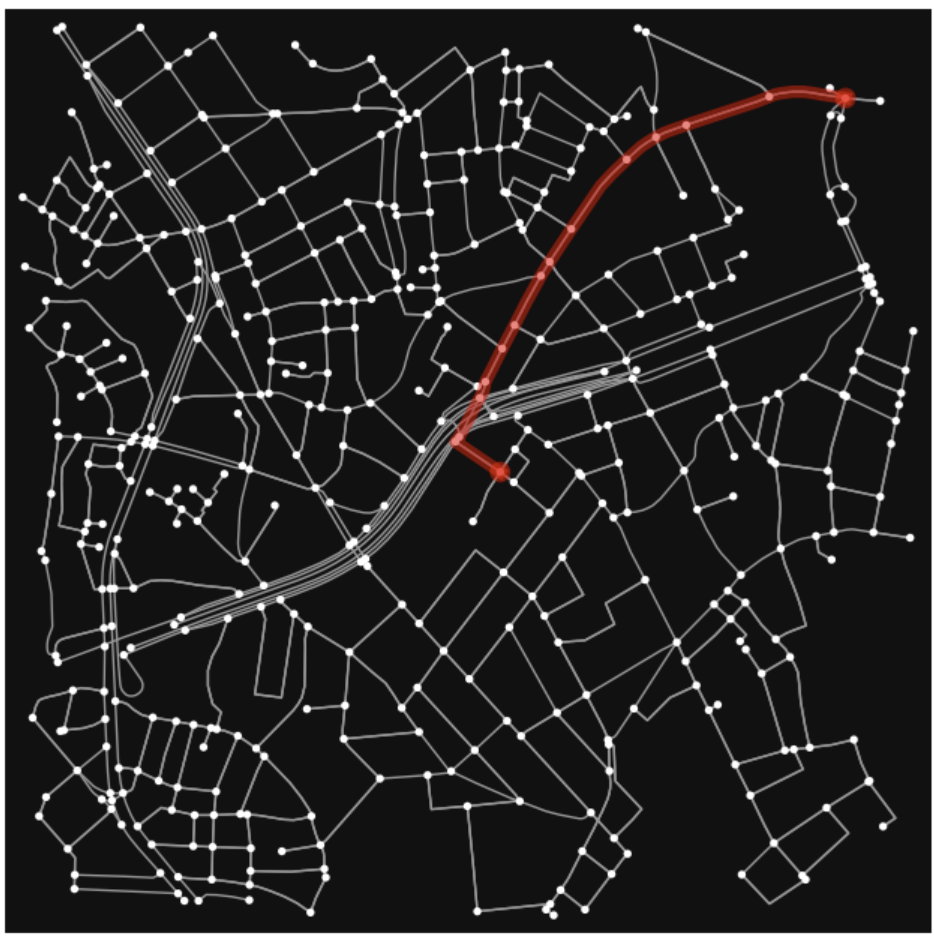

<style scoped>
    h1 {
        font-size: 100px;
        padding-top: 150px;
        padding-bottom: 100px;
        text-align:center
    }
    p {
        text-align: right
    }
</style>
# 安全に目的地に着きたい

2024-10-20 Kazuko Ohmura

---
# 私は誰だ？


**かめちゃん** です。
PyLadies Tokyo のスタッフ

---
# 車を買いました


買った目的は **運転能力の向上** 。
田舎で適当な車に問題なく乗るのが目標。

---
# 運転苦手

## 原因

* 最初の車が左ハンドルの大きめBMWだった。
    * 当時の上司が **タダ** で貰った。
    * これが不幸の始まり。
* 免許を取ってから **9年後** に運転開始
* 1年後に辛くて右ハンドルのコンパクトカー **デミオ** を購入
* その後、出産、子供小さいなどの理由でほぼ旦那が運転

---
# 運転再開

## Why?

* 親が高齢になり、いろいろあって時々田舎に帰る生活。
* 田舎で車に乗れないと役に立たない。

## 対策
* ペーパードライバー講習受講
* 車購入、毎日運転

---
# 安全に運転するために

* 道の予習、シミュレーション
* 最短距離ではなく運転しやすい道を探る

## そこで
* 左折だけで目的地につきたい
* 車線変更もなるべくしたくない
    * 右折しなければ右車線に行かなくていい気がする

---
<!--
_backgroundColor: white
-->
# 道順を調べたい

## OSMnx
https://osmnx.readthedocs.io/en/stable/

OpenStreetMap APIを使えるPythonのパッケージ

```
$ pip install osmnx
```

---
<!--
_backgroundColor: white
-->
# OpenStreetMap
https://www.openstreetmap.org/about

オープンライセンスで使える地図。世界中でメンテナンスされている。

日本のコミュニティもあるようです
https://openstreetmap.jp/node/762

---
<!--
_backgroundColor: white
-->


# HENNGEを中心とした半径600mの道路
```python
# HENNGE
hennge = 35.65495728145334, 139.69494603459512
G = ox.graph_from_point(center_point=hennge, 
                        dist=600,  # meters 
                        network_type="drive",
                       simplify=True
                       )
fig, ax = ox.plot_graph(G)
```

---
<!--
_backgroundColor: white
-->



# 渋谷駅からHENNGEまでの最短距離

```
# 最短経路を取得
route = ox.shortest_path(G, start_node, end_node)  
# ルートを表示
fig, ax = ox.plot_graph_route(G, route, route_color='r', route_linewidth=6) 
```

---
<!--
_backgroundColor: white
-->


# 右折しないように作ってみましたが、未完成

* 右折しているときは、違うノードに移動
  * 移動したノードからゴールまでの最短距離を求めて、右折がないか確認
* 右折しないノードがないときは1つ前のノードに戻る
  * 1回行ったノードにはいかないようにする
  * 後は再帰でぐるぐる

---
<!--
_backgroundColor: white
-->


# フィルターもできます


---
<!--
_backgroundColor: white
-->


# 地図に重ねたり


---
# まとめ

* 久しぶりに車に乗る人は、兎にも角にも **ペーパードライバー講習** を受けよう
* 私が苦手なのは **右折** ではなくて **車線変更**
* 目的地に着きたいなら、 **右折** もしたほうがいい
* 埼玉県は道が広くて、どこでも駐車場があるので、東京都の100倍運転しやすい（個人の感想です）
    * 私の地元は人口も少ないので、さらに埼玉県の100倍運転しやすい（と、思う）